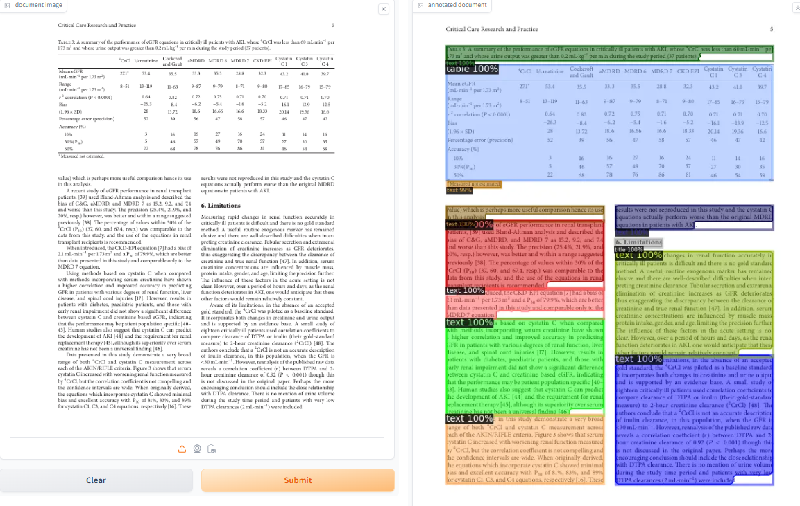

# Document layout analysis with DiT(Document Image Transformer)

## Table of Contents

+ [Introduction](#introduction)
+ [Interface Ressult](#interface)
+ [License](#license)

## Introduction 
Demo for Microsoft's DiT, the Document Image Transformer for state-of-the-art document understanding tasks. This particular model is fine-tuned on PubLayNet, a large dataset for document layout analysis (read more at the 
links below). To use it, simply upload an image or use the example image below and click 'Submit'. Results will show up in a few seconds. If you want to make the output bigger, right-click on it and select 'Open image in 
new tab'.
## Here are some application interface results 

## License 

This project is licensed under the Apache License - see the [LICENSE](LICENSE) file for details.
